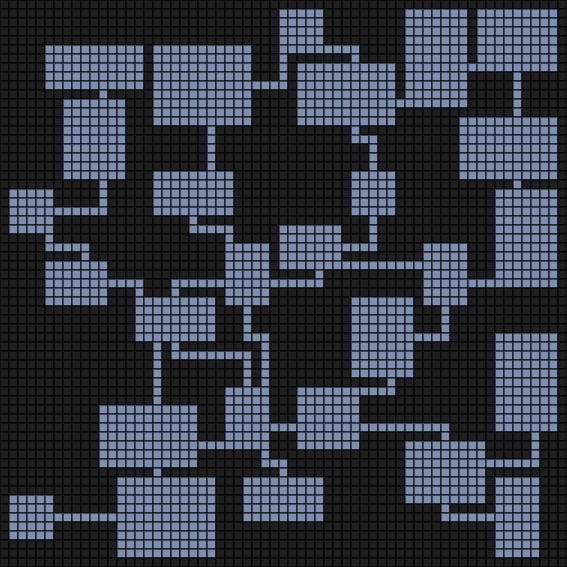

# Dungeon-Generator
A simple dungeon generator written in javascript.

## How it Works
The generator starts by trying to place randomly sized rooms at random locations on the grid. If an existing room would collide with the prospective room, the placement fails and the process repeats with a new randomly generated room. The number of placement attempts is pre-determined.

Once all the rooms have been placed, a Delaunay triangulation is performed using the center tile of each room as a vertex, creating a graph of all the rooms. The code used to perform the triangulation can be found [here](https://github.com/ironwallaby/delaunay).

The Delaunay triangulation is then used to create a minimum spanning tree connecting all the rooms. To make the dungeon more interesting, some edges which were removed from the triangulation are re-added to the tree.

Finally, the A* pathfinding algorithm is used to create pathways between rooms which are connected in the modified tree.

